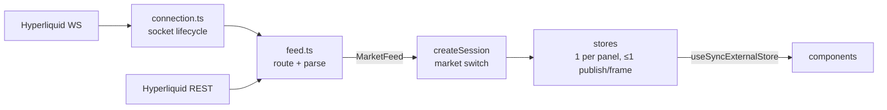
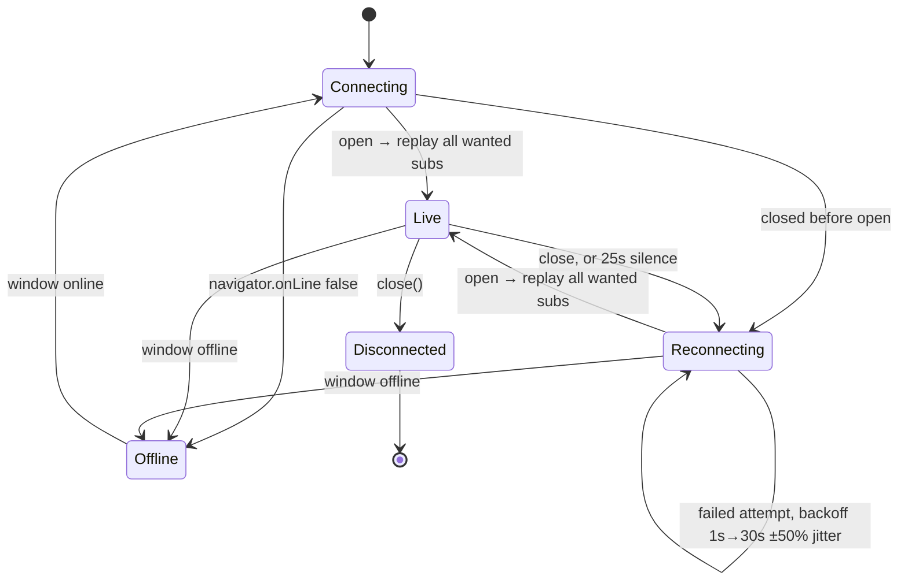
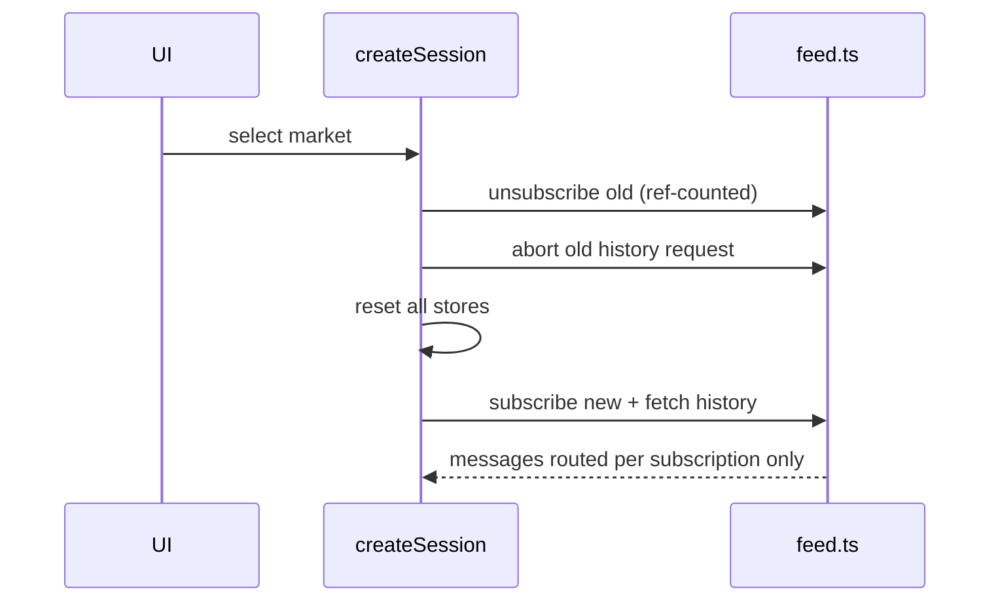
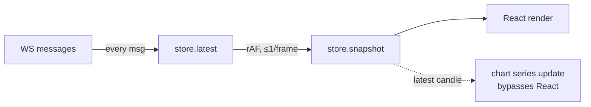

# Primex trade book

Real-time exchange UI on **Hyperliquid testnet**: market selector, order book, trades tape, 1m candle chart.

Live on netlify: https://hl-testnet-candle-order-trade.netlify.app/

## Run

```sh
pnpm install && pnpm dev    # no env vars or API keys; talks to public testnet endpoints
```

| Script | Does |
|---|---|
| `pnpm dev` | dev server, hot reload |
| `pnpm build` | `tsc -b` + production build |
| `pnpm check` | Biome lint + format + import sort (with fixes) |
| `pnpm test` | Vitest unit tests (trades, subscription keys, book view, market switching) |

## Features

| Panel | Source | Shows |
|---|---|---|
| Markets | — | BTC, ETH, SOL, `xyz:NVDA` (HIP-3, thin book → tests empty-side handling) |
| Order book | WS `l2Book` | 11 levels/side: price, size, cumulative, depth bar; spread (abs + %) |
| Trades tape | WS `trades` | latest 50: price, size, side (text + colour), local time |
| Chart | REST `candleSnapshot` + WS `candle` | 300 × 1m bars, then live |
| Status badge | socket | Connecting · Live · Reconnecting · Offline · Disconnected; panels dim when not live |

## Architecture



| Folder | Role |
|---|---|
| `domain/` | App types (`Book`, `Trade`, `Candle`, `Status`) + `MarketFeed` contract. No wire formats. |
| `hyperliquid/` | Adapter: `wire.ts` shapes → `parse.ts` → `connection.ts` socket → `feed.ts` implements `MarketFeed` |
| `stores/` | One store per entity; `createSession` is the only market switcher |
| `components/` | Views; read stores only |
| `session.ts` | Composition root |

New venue = new adapter; `stores/` and `components/` unchanged.

### Socket lifecycle — `hyperliquid/connection.ts`



- Wanted subs kept in a set (canonical key) → connect and reconnect share one path
- Ping every 10s (also satisfies HL's 60s idle limit)
- Dropped sockets get handlers detached first → no stray second reconnect
- After reconnect: candles refetched from REST; book needs nothing (full snapshots); trades de-duped by id

### Market switch — `stores/createSession.ts`



In-flight messages for the old market can't reach the new one.

### Rendering



- Burst → one render; background tab → none (rAF paused)
- Separate stores: a trade doesn't re-render the book
- Chart `setData()` only on switch / reconnect
- Book rows: fixed height, padded to 11, keyed by position; depth via `scaleX`; `contain: layout paint`; tabular digits
- Tape rows keyed by trade id

### States

| State | UI |
|---|---|
| Loading | Skeleton rows; "Loading chart…" |
| Empty | "No trades yet"; one-sided book → spread "—" |
| Connection lost | Badge + dimmed panels + tooltip |
| History failed | Error in chart |
| Protocol errors | Logged, not thrown |

## Libraries

| Library | Why |
|---|---|
| React 19 + TS + Vite | Preferred stack; fast dev, static build |
| No state lib | Frame batching is ~60 lines on `useSyncExternalStore` |
| Tailwind v4 + shadcn/ui (Radix) | Accessible Tabs / ToggleGroup / ScrollArea as owned source; only what's used (4 components + Toggle, a dependency) |
| lightweight-charts | Canvas financial chart, incremental `update()`, small |
| Biome | Lint + format + imports in one tool |

## Tested by hand

| Test | Result |
|---|---|
| Wi-Fi off, then on | Reconnects |
| Wi-Fi off, switch markets, Wi-Fi on | Reconnects to the selected market only; no messages from the previous one |
| Rapid market switching | Old channels unsubscribed; only the selected market's data shows |
| Wi-Fi off for over 35 s, then on | Reconnects to the selected market |

Turning Wi-Fi off fires the browser's `offline` event, so these cover the offline path. The
heartbeat path (a socket that goes silent while the browser still reports online, detected
after 25–35 s) isn't covered by them.

## AI usage

- **AI as reviewer:** reviewing this repo against the brief, it found three bugs:
  - the first connection status was lost before anything subscribed
  - the live candle survived a market switch (I had commented out `drawLatest()` rather
    than find the cause)
  - `domain/` imported a type from the Hyperliquid adapter

  AI wrote the fixes.
- **AI-written, checked by me:**
  - setup fixes: the shadcn `@` alias, removing Vite's template CSS, switching Base UI to Radix
  - the unit tests, from properties I chose. Each was checked by breaking the code it covers;
    one could never fail and was rewritten.
  - the first draft of this README
- **Decisions, with AI as a sounding board:**
  - no React Compiler: book rows re-render because their data changes, so there's nothing to skip
  - no shadcn Card: styling only, and too roomy for a dense trading screen
  - Radix over Base UI: my reference used Radix, so components port without translating
  - Biome over oxlint + Prettier: one tool for linting and formatting

## Known limitations

- "Live" = socket open, not fresh data; briefly shows pre-outage data undimmed after reconnect
- Market metadata (size decimals) hardcoded, not from `meta`
- Wire messages typed, not runtime-validated

## Next steps

- [ ] Metadata from `meta`
- [ ] Book price grouping (`nSigFigs`)
- [ ] Chart interval switcher
- [ ] Flash rows on change
- [ ] "Syncing" state between open and first message
- [ ] Cross-tab shared socket (SharedWorker)
- [ ] Connection tests with a fake WebSocket (reconnect, heartbeat, subscription replay)
